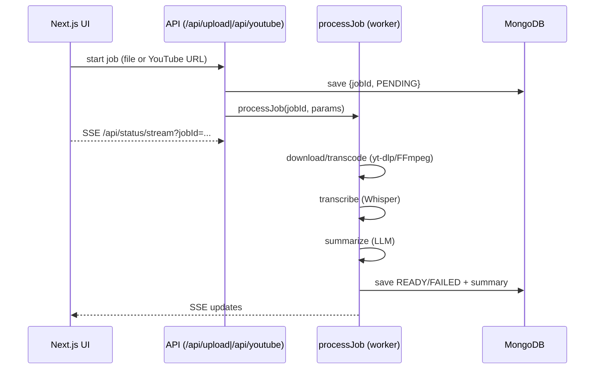

# Briefly.AI — Automatic Audio/Video Summaries (Next.js + Whisper + LLM)

> Web app that ingests audio/video files or YouTube links, transcribes them, and generates multi-level summaries. Built with **Next.js (App Router)**, **TypeScript**, **MongoDB**, **SSE**, **yt-dlp/FFmpeg**, and **OpenAI** (Whisper + LLM). Includes **unit/integration tests (Vitest)** and **E2E tests (Playwright)** with **full mock mode**.

## Features

* **Two ingestion modes**: upload a file or paste a **YouTube** URL
* **Live status via SSE**: `PENDING → DOWNLOADING → TRANSCRIBING → SUMMARIZING → READY/FAILED`
* **Multiple summary levels**: `short | medium | detailed | extreme`
* **JWT auth**, jobs history, and job details
* **Configurable limits** (file size, max video length, rate limit)
* **Prod-oriented**: Dockerfile, Compose, standalone Next build, health endpoints
* **Strong tests**:

  * Vitest unit/integration (e.g., rate limiter, `/api/upload`, `/api/youtube`)
  * Playwright E2E with **mock yt-dlp** and **mock worker** (no OpenAI/yt-dlp calls)

## Architecture (high level)



## Project layout (key folders)

```
src/
  app/
    (UI pages & App Router API routes)
    api/
      upload/route.ts       # accepts multipart uploads
      youtube/route.ts      # validates YT URL, checks duration
      status/(...)/         # status + SSE stream endpoints
      health/route.ts       # health (ok/env/ts)
      health/db/route.ts    # DB health
  server/
    middleware/             # auth, rate limit, IP extraction
    services/               # yt-dlp, whisper, summarizer, audio utils
    workers/
      processJob.ts         # main pipeline + MOCK_MODE
      metrics.ts, fileSize.ts
    state/statusStore.ts    # in-memory status + persistence hooks
  shared/                   # shared types
tests/
  unit/                     # Vitest unit tests
  integration/              # Vitest API integration tests
  e2e/                      # Playwright E2E, .env.e2e, yt-dlp-mock.js
```

## Environment configuration

Create `.env` (production/dev) and **do not commit secrets**. Example (short):

```env
# DB
MONGODB_URI=mongodb://mongo:27017/
MONGODB_DB=briefly

# OpenAI
OPENAI_API_KEY=sk-...

# Auth
JWT_SECRET=change_me_min_16_chars
ADMIN_TOKEN=

# Limits
MAX_UPLOAD_MB=100
MAX_VIDEO_MINUTES=60
RATE_LIMIT_PER_MIN=20

# yt-dlp
YTDLP_PATH=/usr/local/bin/yt-dlp
YTDLP_COOKIES_PATH=/etc/briefly/cookies/youtube.cookies.txt

# Mocks (for local/dev)
MOCK_MODE=false
MOCK_SPEED=1
MOCK_FAIL_PROB=0.3
```

### E2E test env (`tests/e2e/.env.e2e`)

Used only by Playwright runs. Typical contents:

```env
E2E_PORT=3000
BASE_URL=http://localhost:3000

# Fast & cheap E2E
MOCK_MODE=true
MOCK_SPEED=0.25
RATE_LIMIT_PER_MIN=60
MAX_UPLOAD_MB=50
MAX_VIDEO_MINUTES=30

# DB for tests
MONGODB_URI=mongodb://127.0.0.1:27017/briefly-e2e
NODE_ENV=test
SKIP_ENV_VALIDATION=true

# Playwright/localStorage key (JWT)
E2E_TOKEN=briefly_token
```

## Quick start (Docker / Docker Compose)

> Requires Docker & Docker Compose.

```bash
# 1) Build app image (yt-dlp version can be overridden)
docker compose build

# 2) Run app + MongoDB
docker compose up -d

# 3) Open
open http://localhost:3000

# 4) Health checks
curl -fsS http://localhost:3000/api/health
curl -fsS http://localhost:3000/api/health/db
```

The provided `Dockerfile`:

* builds a **standalone** Next app,
* installs **ffmpeg** and **yt-dlp** (version controlled by `YTDLP_VERSION` build arg),
* exposes **/api/health** and **/api/health/db** via container **HEALTHCHECK**.

## Local development (Node)

```bash
npm i
# dev server (optionally enable MOCK_MODE inline)
MOCK_MODE=true YTDLP_PATH=./tests/e2e/yt-dlp-mock.js npm run dev
```

### Security headers / CSP

`next.config.ts` sets strict headers including **CSP**. In dev we allow `ws:` and `unsafe-eval` to support tooling; in prod we keep it strict. If you add 3rd-party domains (e.g. analytics), update `connect-src`/`script-src` accordingly.

## Testing

### Vitest (unit & integration)

```bash
npm run test
```

Covers: rate limiter, `/api/upload`, `/api/youtube`, edge cases (invalid body, duration limits, MIME handling), and failure paths. Time is faked where needed.

### Playwright (E2E)

* `tests/e2e/playwright.config.ts` starts Next in **MOCK\_MODE** with a **yt-dlp mock** (`tests/e2e/yt-dlp-mock.js`) and prepares **auth storage** (`auth.setup.ts` tries to log in; if “User not found”, it registers and re-logs).
* Tests cover **upload** and **YouTube** happy paths, **too long** validation, **forced fail** (mock worker), **toast error** watcher, and **SSE propagation** across pages (home, list, details).

Commands:

```bash
# headless
npm run test:e2e

# debug with UI
npx playwright test --ui
```

## Mock mode (no external calls)

* `MOCK_MODE=true` makes `processJob` simulate stages & timings without calling Whisper/LLM.
* YouTube metadata/downloading in E2E is mocked by `YTDLP_PATH=./tests/e2e/yt-dlp-mock.js`.
* You can force a failure with env: `MOCK_FORCE_FAIL=true` or set `MOCK_FAIL_PROB`.

## API (selected)

* `POST /api/upload` — multipart (`file`, `level`) → `{ jobId }` or `413/400`
* `POST /api/youtube` — `{ url, level }` → validates URL and **duration** via yt-dlp → `{ jobId }`
* `GET /api/status/stream?jobId=...` — **SSE** stream with live status
* `GET /api/health` — `{ ok, env, ts }`
* `GET /api/health/db` — `{ ok, mongo: { pingMs, version } }`

Auth: login/register endpoints return a JWT (stored in `localStorage`). Middleware (`withAuth`) protects job endpoints.

## Rate limiting

`createRateLimiter(tokensPerMin)` uses a global token bucket keyed by client IP (`x-forwarded-for` aware). Unit tests verify minute window & fractional refill behavior.

## Troubleshooting

* **yt-dlp not found**: set `YTDLP_PATH` or use the Docker image which installs it.
* **CSP errors in browser console**: if you load extra origins (images, scripts), add them to CSP in `next.config.ts`.
* **E2E auth**: Playwright writes storage state to `playwright/.auth/user.json`. Do **not** commit this file.
* **Health failing in Compose**: check Mongo container logs; ensure `MONGODB_URI` points to `mongo`.

---

# Briefly.AI — Automatyczne streszczenia audio/wideo (Next.js + Whisper + LLM)

> Aplikacja webowa do streszczania nagrań audio/wideo (upload lub YouTube). Stos: **Next.js (App Router)**, **TypeScript**, **MongoDB**, **SSE**, **yt-dlp/FFmpeg**, **OpenAI** (Whisper + LLM). Zawiera **testy jednostkowe/integracyjne (Vitest)** oraz **E2E (Playwright)** z pełnym **trybem mock**.

## Funkcje

* **Dwa tryby**: wgrywanie pliku lub **link YouTube**
* **Status na żywo (SSE)**: `PENDING → DOWNLOADING → TRANSCRIBING → SUMMARIZING → READY/FAILED`
* **Poziomy streszczeń**: `short | medium | detailed | extreme`
* **JWT auth**, historia zadań i widok szczegółów
* **Limity** rozmiaru, długości wideo i zapytań/min
* **Wersja produkcyjna**: Dockerfile, Compose, standalone build, healthchecki
* **Testy**: Vitest + Playwright (mock yt-dlp, mock worker)

## Architektura (skrót)

* Frontend (Next.js/React) + trasy API (App Router) w jednym repo
* Worker `processJob` wykonuje pipeline: **yt-dlp/FFmpeg → Whisper → LLM**
* Statusy przechowywane w `statusStore` i publikowane przez **SSE**
* MongoDB trzyma dane użytkowników, jobów i metryki

## Struktura katalogów

Zob. sekcja angielska „Project layout”.

## Konfiguracja `.env`

Zob. angielski przykład `.env` i `tests/e2e/.env.e2e`. Najważniejsze:

* `MONGODB_URI`, `OPENAI_API_KEY`, `JWT_SECRET`
* `MAX_UPLOAD_MB`, `MAX_VIDEO_MINUTES`, `RATE_LIMIT_PER_MIN`
* `YTDLP_PATH`, `YTDLP_COOKIES_PATH`
* (Dev/E2E) `MOCK_MODE`, `MOCK_SPEED`, `MOCK_FAIL_PROB`

## Szybki start (Docker/Compose)

```bash
docker compose build
docker compose up -d
open http://localhost:3000
curl -fsS http://localhost:3000/api/health
curl -fsS http://localhost:3000/api/health/db
```

## Lokalny development

```bash
npm i
MOCK_MODE=true YTDLP_PATH=./tests/e2e/yt-dlp-mock.js npm run dev
```

### Nagłówki bezpieczeństwa / CSP

`next.config.ts` ustawia CSP i nagłówki (X-Content-Type-Options, X-Frame-Options, itp.). W dev dopuszczamy `ws:` oraz `unsafe-eval` dla narzędzi; w produkcji nagłówki są ostrzejsze. Dodając nowe zewnętrzne źródła uaktualnij `connect-src`/`script-src`.

## Testy

* **Vitest**: `npm run test` – logika limitów, API `/api/upload` i `/api/youtube`, krawędzie i błędy.
* **Playwright**: `npm run test:e2e` lub `npx playwright test --ui` – rejestracja/logowanie (auto w `auth.setup.ts`), ścieżki upload/YouTube (READY/FAILED), walidacje (too long), obserwacja **SSE** na stronie głównej, liście i detalach, obserwacja toasta błędu.

## Tryb mock (bez zewnętrznych kosztów)

* `MOCK_MODE=true` uruchamia symulację w `processJob` (pseudolosowe czasy, opcjonalna wymuszana awaria `MOCK_FORCE_FAIL=true`).
* W E2E metadane YouTube i „pobieranie” audio są emulowane skryptem `tests/e2e/yt-dlp-mock.js` (ustaw `YTDLP_PATH`).

## API (wybrane)

* `POST /api/upload` — multipart: `file`, `level` → `{ jobId }` lub błąd `413/400`
* `POST /api/youtube` — `{ url, level }` → walidacja URL i **długości** (yt-dlp)
* `GET /api/status/stream?jobId=...` — strumień **SSE**
* `GET /api/health` i `GET /api/health/db` — zdrowie aplikacji/DB

## Ograniczanie zapytań

Globalny kubełkowy limiter (token bucket) na IP (`x-forwarded-for`). Przetestowany w Vitest (uzupełnianie co minutę, częściowe doładowanie).

## Rozwiązywanie problemów

* **Brak yt-dlp**: ustaw `YTDLP_PATH` lub użyj kontenera (instaluje binaria).
* **Błędy CSP w konsoli**: dodaj nowe domeny do `next.config.ts`.
* **E2E auth**: stan sesji w `playwright/.auth/user.json` – nie commitujemy.
* **Health w Compose**: sprawdź logi Mongo i `MONGODB_URI`.

---

**Author**: Arkadiusz Ostrowski
**Thesis**: This repository accompanies the engineering thesis describing the design and implementation of **Briefly.AI**.
